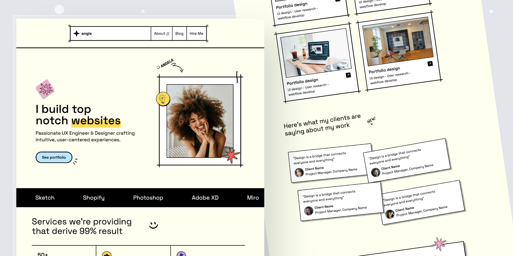

# Angie

ANGIE is a sleek Astro portfolio template built for creatives and developers. Featuring responsive layouts, customizable sections, and a bold brutalist design, it’s made to help you stand out and showcase your work with style.





### Dependencies used in this project:
- [TailwindCSS](https://tailwindcss.com/)
- [GSAP](https://gsap.com/)
- [Remix Icon](https://remixicon.com/)

### Credits:
- [Pexels images](https://www.pexels.com/)
- [Design inspo](https://www.figma.com/design/YHGwlMXQLVCE3mTF4JVA5I/2024-Portfolios-(Community)?node-id=1-914&t=6JAt4v8pqxzppZ0b-0)


Inside of your Astro project, you'll see the following folders and files:

```text

├── public/
│   └── favicon.svg
├── src/
│   ├── components/
│   │   └── Bars.astro
        └── Button.astro
        └── CallToAction.astro
        └── Footer.astro
        └── Header.astro
        └── Hero.astro
        └── MarddownPost.astro
        └── Reviews.astro
        └── Service.astro
        └── Tools.astro
        └── Work.astro
│   ├── layouts/
│   │   └── Layout.astro
│   └── pages/
        └── posts/
        └── blog.astro
        └── index.astro
└── styles/
└── package.json
```

Astro looks for `.astro` or `.md` files in the `src/pages/` directory. Each page is exposed as a route based on its file name.

There's nothing special about `src/components/`, but that's where we like to put any Astro/React/Vue/Svelte/Preact components.

Any static assets, like images, can be placed in the `public/` directory.

## 🧞 Commands

All commands are run from the root of the project, from a terminal:

| Command                   | Action                                           |
| :------------------------ | :----------------------------------------------- |
| `npm install`             | Installs dependencies                            |
| `npm run dev`             | Starts local dev server at `localhost:4321`      |
| `npm run build`           | Build your production site to `./dist/`          |


## 👀 Curious to Explore More?

Check out [LAB-CH3](https://github.com/LaB-CH3) for a growing collection of current and future templates. 

If you’ve found this helpful, consider fueling my creativity!  
[](https://www.buymeacoffee.com/d2OuR1c)

